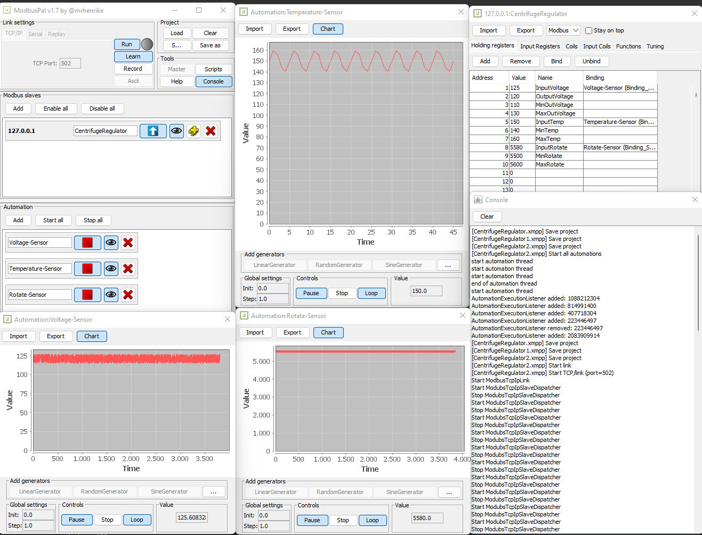

# ModbusPal Enhanced v1.7 by @mrhenrike
ModbusPal - a Java MODBUS simulator
- Forked by https://sourceforge.net/projects/modbuspal/
- Changed by André Henrique (Twitter @mrhenrike / LinkedIn @mrhenrike)

This release of ModbusPal Enhanced v1.7 is a release candidate version.

### About ModbusPal Enhanced
ModbusPal Enhanced is a MODBUS slave simulator improved, based on ModbusPal v1.6b by Community. Its purpose is to offer an easy to use interface with the capabilities to reproduce complex and realistic MODBUS environments. The core of ModbusPal Enhanced is written in Java. TCP/IP is supported natively, and the serial communication is supported if RxTx library is installed on the computer.

### What's new in v1.7?
- Fixing to load a xmpp file
- Fixing automation chart (requires jfreechart)
- Fixing add new scripts
- Added scripts samples on "Examples" directory
- Updated the User Guide
- Added optional command line arguments for the executable JAR:
 ```    --loadFile - Loads a previously saved file at launch. Provide the absolute path.
    --portNumber - An IP port number to connect this current configuration.
    --help - A command line help message to display the command line arguments.
    --hide - Start ModbusPal without showing the UI elements so it can run in a headless environment.
```
- ModbusPal can be executed without a GUI
- Updated to jython 2.7.0
- Updated to jfree-freechart 1.0.15 
- Updated to jfree-jcommon 1.0.17 
- Updated to xml-apis 1.3.04
- Updated to itext 2.1.5 
- Updated to rxtx 2.2.2
- Generated a JavaDoc dist/javadoc
- Added a docker builder

### Known limitations:
- "Tuning" features are not documented yet
- Javadoc very incomplete

### How to run
You can add your xmpp project from modbuspal as first argument:
`java -jar /path/absolute/ModbusPalEnhanced.jar -loadFile=/path/absolute/samples/project01.xmpp`

The load file function is working only xmpp project in 1.7 version and always use absolute path when you informe a file

or you can set MODBUSPAL_PROJECT environment variable as path to your project file and then just run
`java -jar /path/absolute/target/ModbusPalEnhanced.jar`

### Run without UI ###

You can start ModbusPal without showing the UI elements so it can run in a headless environment, or if you just don't care to open the window with the -hide flag. You can use it in conjuction with a project file to make modbuspal start all automations and start listening for requests using the command:
```
java -jar <<pathtojar>>/ModbusPal.jar -loadFile=<<projectfile>> -hide
```
Only works with TCP/IP over port 502 currently. You also need to have all your slaves listening on localhost/127.0.0.1.

## Modbus-Simulator-Setup
This setup is intended to be used on any IoT Gateway depending on the OS and ARCH for edge processing and connecting to real Modbus addresses.

## Setting up ModbusPal:
ModbusPal is a Java Modbus simulator with GUI to control and simulate the Modbus connection.
The below components are required if you are palnning to use Modbus to USB converter. For which Serial Communication should be enabled for ModbusPal library. 
```
src/rxtx/[win-arch]/rxtxSerial.dll
src/rxtx/[win-arch]/rxtxParallel.dll
src/rxtx/[win-arch]/RXTXcomm.jar
```
Based on the ARCH and OS you can download the above componets https://bitbucket.org/jlauer/mfz-cdn/downloads/ 
Thanks to [Joe Lauer](https://bitbucket.org/jlauer/).

## For setting up in Microsoft Windows:

**Note:** Set the JAVA path properly pointing to JDK and not to JRE. If JRE is set, uninstall it from Control Panel.
Should set JAVA Path in the environment (Windows):
```
JAVA_HOME: C:\Program Files\Java\jdk1.17xxxx
JRE_HOME: %JAVA_HOME%\jre
Path: %JAVA_HOME%\bin
```
```
Copy src/rxtx/[win-arch]/RXTXcomm.jar ---> <JAVA_HOME>\jre\lib\ext
Copy src/rxtx/[win-arch]/rxtxSerial.dll ---> <JAVA_HOME>\jre\bin
Copy src/rxtx/[win-arch]/rxtxParallel.dll ---> <JAVA_HOME>\jre\bin
```

Run:
`> java -jar ModbusPalEnhanced.jar`

<p align="center">
  
</p>
<p align="center">
  
</p>

## Starting the Modbus Simulator
1. Open the ModbusPal Server.
2. Check settings. TCP Port: 502
3. Add a module slave:
    - Choose Add in Module Slaves fieldset.
    - A new window will open.
4. Select 1 from the list-view and assign a name to the slave.
5. Choose Add.
6. Edit holding registers for the slave:
	  - Choose the button with the eye image.
7. On the Holding registers tab choose Add.
8. In the Add registers popup input 1 to 10 and choose Add.
9. In the table double click on the first row at the column named "value" and put the value 533.
	  - Address 1: 533
10. Close the popup.
11. Choose Run.
12. Open Console to see the messages.

## Python2.7 code sample to read the messages
Install [PyModbusTCP](https://pypi.org/project/pyModbusTCP/)
> pip2 install pyModbusTCP

Execute the python script `Examples/ModbusRead.py` to read the values from holding registers.

## How to build (Using Docker) ##
--------------------------------------
```docker build -t modbuspal-builder .
docker run --name modbuspal-builder modbuspal-builder
docker cp modbuspal-builder:/usr/src/app/dist/ModbusPal.jar .
docker cp modbuspal-builder:/usr/src/app/dist/modbuspal-help.zip .
docker cp modbuspal-builder:/usr/src/app/dist/modbuspal-javadoc.zip .
```

__You can either run with a included sample project__
`docker run -p502:502 -e MODBUSPAL_PROJECT=/projects/project01.xmpp modbuspalruntime`

__Or mount your project and refer to it via environment variables__
`docker run -p502:502 -v ${path-to-my-projects}:/projects -e MODBUSPAL_PROJECT=/projects/my-project01.xmpp modbuspalruntime`

## Source-code Project in Java
### Prerequisites ###
- Apache Netbeans (https://netbeans.apache.org/)
- JDK 17 (https://www.oracle.com/java/technologies/javase/jdk17-archive-downloads.html)
- Download ivy http://ant.apache.org/ivy/download.cgi (suggest extracting to C:\jars)

### Setup Project ###
1. Download and install netbeans https://netbeans.apache.org/download/index.html
2. Open Netbeans and select `tools > options > Java > ant` and add the ivy jar to the classpath
3. Run project

### Build Jar ###
1. Build Project (click hammer or F11)
2. Jar will be in [ProjectFolder]/dist

